<h1 align="center">Итоговый проект по курсу Java на платформе ULearn</h1>
<h2 align="center">Вариант 1. База СПБ.</h2>

  <h3>Ход решения</h3>
  <ol>
    <li><a href="#1">Написать модель</a></li>
    <li><a href="#2">Написать парсер CSV файла</a></li>
    <li><a href="#3">Заполнить базу данных данными с парсера</a></li>
    <li><a href="#4">Разработать sql-запросы для получения данных к каждой задаче</a></li>
    <li><a href="#5">Написать методы для получения из базы готовых к выводу данных для каждой задаче</a></li>
    <li><a href="#6">Построить график для 1ого задания</a></li>
    <li><a href="#7">Получить и вывести ответы для 2ого и 3его заданий</a></li>
    <li><a href="#result">Выводы</a></li>
  </ol>

    <h3>Написать модель</h3>
    
Для хранение данных до момента заполнения ими базы мною была написана следующая простенькая модель:

    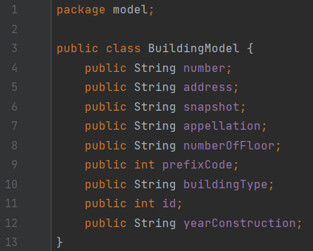

    <h3>Написать парсер CSV файла</h3>
    
Дабы распарсить CSV-файл я применил библиотеку OpenCSV. С её помощью я легко распарсил файл.

    
Сначала я проверяю, установлено ли соединение с базой, далее получаю все строки CSV файла. После я сравниваю кол-во строк в уже существующей базе с кол-вом строк, полученным из CSV-файла. Если они различаются, я запускаю перезапись данных в базу. Это нужно, чтобы не записывать данные в базу, при каждом запуске программы, а только если CSV-файл был изменён.

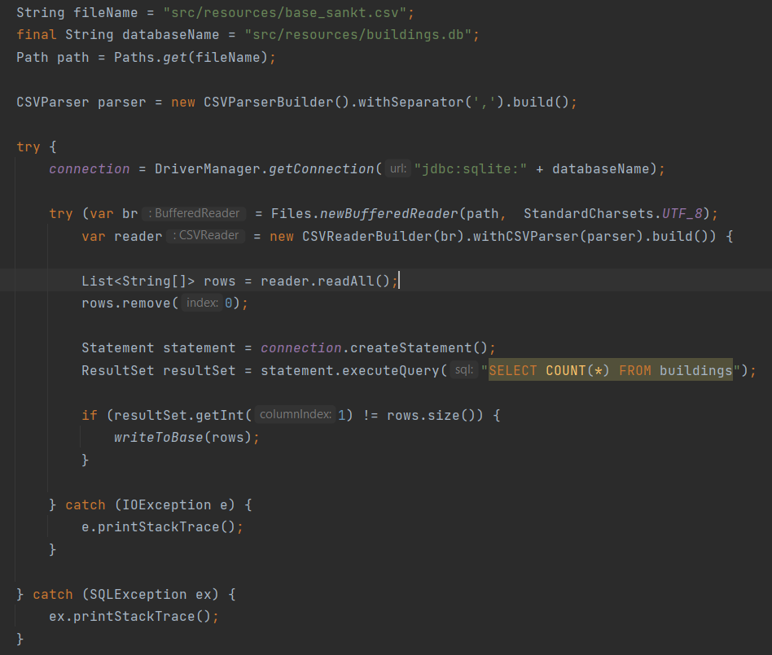

    <h3>Заполнить базу данных данными с парсера</h3>
    
Функция, которая вызывается, если CSV-файл был изменён, она инициализирует модель и заполняет её поля данными с парсера.

    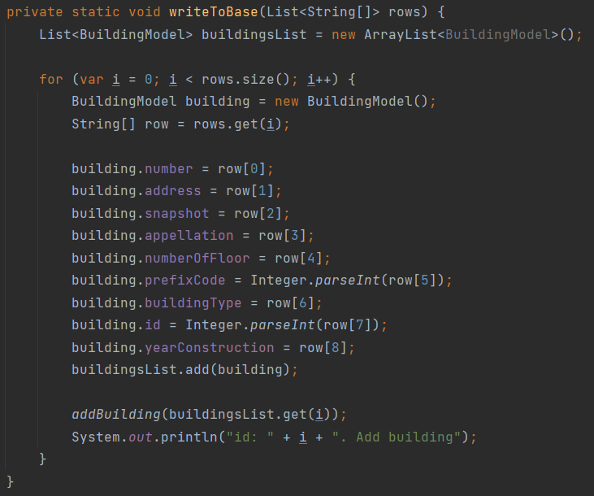
    
Функция, которая вставляет в базу строку, заполненную данными текущей модели.

    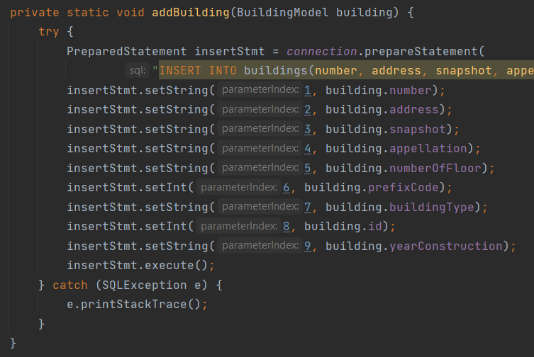
    
SQL запрос для заполнение столбцов базы данными текущего строения

    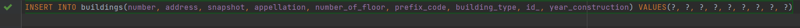

    <h3>Разработать sql-запросы для получения данных к каждой задаче</h3>
    <h4>1ая задача</h4>
    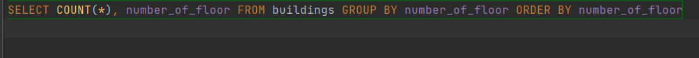
    <h4>2ая задача</h4>
    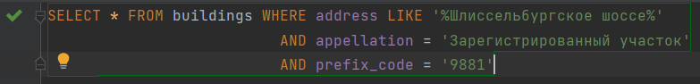
    <h4>3яя задача</h4>
    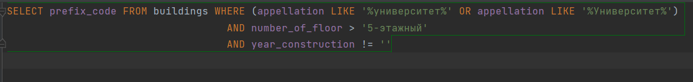

    <h3>Написать методы для получения из базы готовых к выводу данных для каждой задаче</h3>
    <h4>1ая задача</h4>
    
В первой задаче для хранения результирующих данных для построения графика, я использовал словрь, где ключюм была строка (скольки этажный дом), а значением - кол-во этажей.

    
Делая запрос в базу я получаю все уникальные ключи (этажности). Загоняю их в этот словарь и далее преобразую это в TreeMap, дабы отсортировать словарь по ключам.

    
Это сделать у меня получилось не очень хорошо, т.к. не хватило времени, из за большого объёма работ по Проектному практикуму. Поэтому график для 1 заданий будет немного кривоват, извиняюсь :)

    <h4>2ая задача</h4>
    
В этой задаче я получал данные из базы в виде строки, и создавал лист моделей, возвращал его из функции, и по нему строил строку для вывода в консоль.

    <h4>3яя задача</h4>
    
Тут всё максимально просто - сделал запрос в базу, получил нужные prefix_code, вычислил среднее значение, вернул из функции и вывел в консоль.

    <h4>Более подробно со всем описанным в этом блоке можете ознакомиться в файле Main.java.</h4>

    <h3>Построить график для 1ого задания</h3>
    
Во-первых, график получился довольно не ровным, из-за очень большого разброса значений.

    
Во-вторых, как уже говорилось выше, сделать его более равномерным (расположить столбы отсортированными) я немного не успел, из-за чего выглядит не очень красиво.

    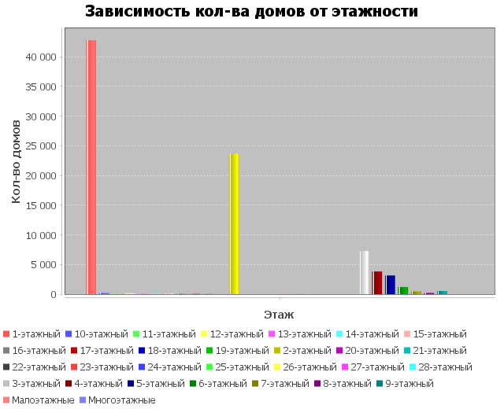

    <h3>Получить и вывести ответы для 2ого и 3его заданий</h3>
    
2 задание. Вывод моделей, полученных из функции, описанной выше.

    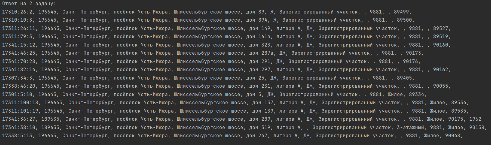
    
3 задание. Вывод среднего значение prefix_code.

    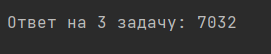

    <h3>Выводы</h3>
    
Благодаря данной работе я научился парсить большие CSV файлы, заносить их в базу данных, делать различные проверки, чтобы оптимизировать программу.

